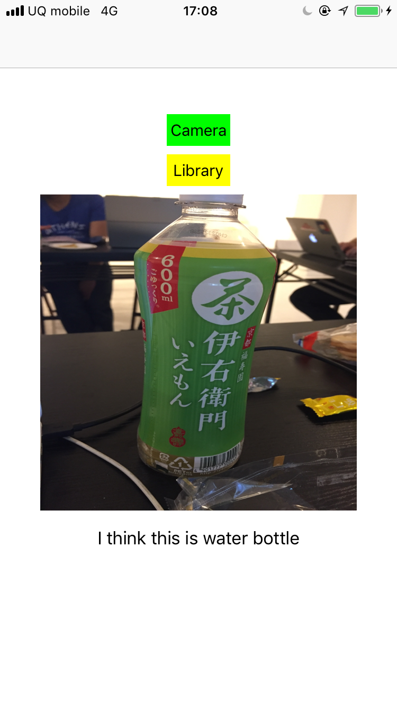

# Notes to run this project
## Step 1
Download the Inceptionv3.mlmodel from following link
https://github.com/yulingtianxia/Core-ML-Sample/blob/master/CoreMLSample/Inceptionv3.mlmodel

## Step 2
Add the above downloaded model into this project.

## Step 3
Build, Install and enjoy

### This project was created by referring the following blog
https://www.appcoda.com/coreml-introduction/

